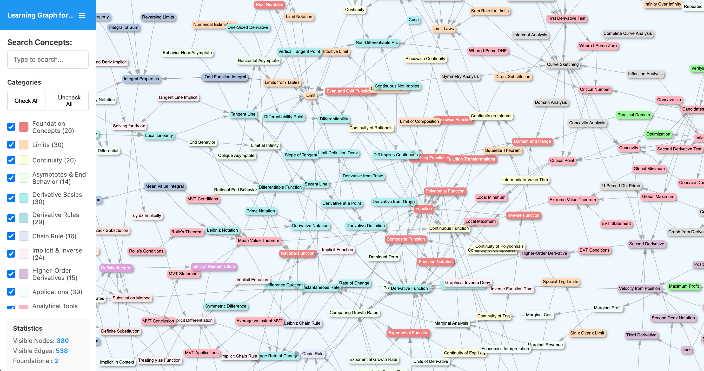
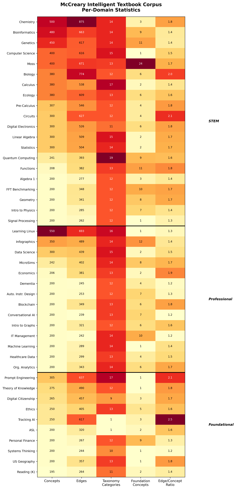

# The McCreary Intelligent Textbook Corpus

This section formally defines the corpus for the first time in literature.

## Corpus Description

The McCreary Intelligent Textbook Corpus comprises 25 open-source educational textbooks hosted on [GitHub](https://github.com/dmccreary). Each textbook contains a standardized learning graph encoded as a CSV file representing a directed acyclic graph (DAG) of concepts and their prerequisite dependencies.

The corpus spans three categories:

- **STEM** (11 domains): calculus, biology, genetics, bioinformatics, statistics, quantum computing, circuits, geometry, ecology, moss, functions
- **Professional** (7 domains): economics, organizational analytics, healthcare data modeling, database selection, conversational AI, automating instructional design, blockchain
- **Foundational** (7 domains): systems thinking, theory of knowledge, digital citizenship, prompt engineering, AI tracking, US geography, ASL

### Key Statistics

| Statistic | Value |
|-----------|-------|
| Concepts per domain | 140--550 (mean: ~267) |
| Total concepts | 12,260 |
| Total edges | 19,405 |
| Taxonomy categories | 1--19 per domain |
| Raw content | MkDocs Markdown (~3,000--8,000 words per textbook) |

## Example: Calculus Learning Graph

The figure below shows the interactive learning graph viewer for the calculus domain, illustrating the DAG structure with color-coded taxonomy categories and prerequisite edges.



*Figure 2: Interactive learning graph viewer for the calculus domain (380 concepts, 539 edges). Each node is a concept, color-coded by taxonomy category. Directed edges represent prerequisite dependencies. The left panel shows category filters and corpus statistics. All 46 domains use this same DAG structure.*

## Corpus Schema

All 46 domains share an identical CSV schema:

```csv
ConceptID,ConceptLabel,Dependencies,TaxonomyID
1,Function,,FOUND
2,Domain and Range,1,FOUND
3,Function Notation,1,FOUND
4,Composite Function,1|3,FOUND
```

- **Dependencies** are pipe-delimited integer references to prerequisite ConceptID values
- **TaxonomyID** assigns each concept to a domain-specific category (e.g., `FOUND` for foundational, `CORE` for core, `ADV` for advanced)

## Corpus Statistics

The heatmap below shows per-domain statistics across all 22 extracted domains, organized by category (STEM, Professional, Foundational). Total: 6,206 concepts and 10,342 dependency edges.



*Figure 5: Per-domain statistics. Color intensity reflects relative magnitude within each column. Domains are sorted by concept count within each category.*

## Quality Properties

All 25 DAGs are validated for:

1. **Single connected component** (no isolated subgraphs)
2. **No self-references** (no concept lists itself as a dependency)
3. **Foundational concepts** (zero prerequisites) $\geq$ 2 per domain
4. **Maximum dependency chain** length reported per domain
