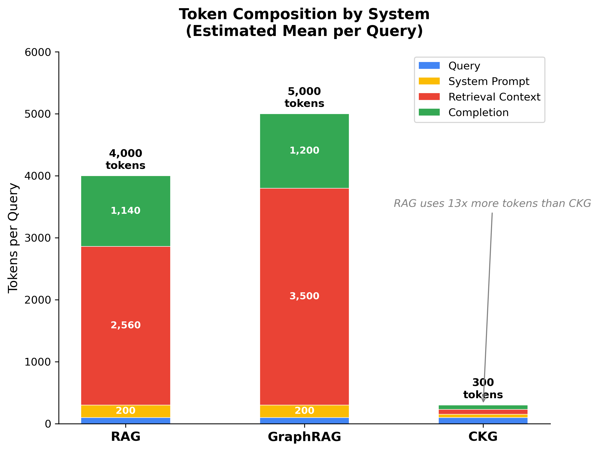

# Results

!!! warning "Pending Experimental Runs"
    This section will be populated after the evaluation harness completes benchmark runs across all 22 domains.

## Macro-Average F1 Across 25 Domains

| System | F1 | EM | Tokens/q | RDS | CPCA ($) |
|--------|----|----|----------|-----|----------|
| RAG | --- | --- | --- | --- | --- |
| GraphRAG | --- | --- | --- | --- | --- |
| CKG | --- | --- | --- | --- | --- |

## F1 by Query Type

| System | T1 | T2 | T3 | T4 | T5 |
|--------|----|----|----|----|-----|
| RAG | --- | --- | --- | --- | --- |
| GraphRAG | --- | --- | --- | --- | --- |
| CKG | --- | --- | --- | --- | --- |

## Token Cost and RDS

*Table 3: Token counts and RDS ratios --- pending.*

*Figure 6: Token composition by system (estimated mean per query). RAG and GraphRAG consume 4,000--5,000 tokens per query, dominated by retrieval context. CKG uses only ~300 tokens---a 13x reduction vs RAG. Values will be updated with experimental measurements.*

## F1 by Hop Depth

*Table 4: F1 at k=1,2,3,4,5+ for each system --- pending.*

*Figure 3: Hop-depth F1 degradation curves --- pending.*

## Structural Metrics

*Table 5: RP, HNR, BC, HR for each system --- pending.*

## Efficiency Curves

*Figure 1: F1 vs token budget curves (3 systems) --- pending.*

*Figure 2: RDS by domain scatter plot (25 points per system) --- pending.*

## Structure Premium Correlation

*Figure 4: RDS ratio vs DAG richness with correlation coefficient --- pending.*
