# Corpus Provenance

This diagram answers the question *where do the inputs to the three retrieval
pipelines come from?* in the specific case of the McCreary Intelligent
Textbook Corpus. It is useful context for reading the RAG, GraphRAG, and CKG
workflows in Figure 1 of the paper, because the three systems do **not**
start from independent corpora.

```mermaid
%%{init: {'theme':'base','themeVariables':{'fontFamily':'Helvetica, Arial, sans-serif','fontSize':'14px','primaryColor':'#ECEFF1','primaryBorderColor':'#455A64','primaryTextColor':'#263238','lineColor':'#455A64','clusterBkg':'#FAFAFA','clusterBorder':'#B0BEC5'}}}%%
flowchart LR
  classDef human fill:#FFF3E0,stroke:#E65100,stroke-width:1.5px,color:#BF360C
  classDef skill fill:#ECEFF1,stroke:#37474F,stroke-width:1.5px,color:#263238
  classDef artifact fill:#FFF8E1,stroke:#F9A825,stroke-width:2px,color:#E65100
  classDef rag fill:#E3F2FD,stroke:#1565C0,stroke-width:1.5px,color:#0D47A1
  classDef graphrag fill:#E0F2F1,stroke:#00695C,stroke-width:1.5px,color:#004D40
  classDef ckg fill:#FCE4EC,stroke:#AD1457,stroke-width:1.5px,color:#880E4F

  Author(["Course author"]):::human --> Desc["Course description<br/>(~1 page: audience,<br/>prerequisites,<br/>learning objectives)"]:::human
  Desc --> LGG["/learning-graph-generator<br/>Claude Code agent skill"]:::skill
  LGG --> SME{{"SME review<br/>(2–4 hours)"}}:::human
  SME --> DAG[("learning-graph.csv<br/>G = (C, E, T, τ)<br/>200–550 concepts")]:::artifact
  DAG --> CCG["/chapter-content-generator<br/>Claude Code agent skill"]:::skill
  CCG --> MD[("Markdown chapter corpus<br/>(MkDocs textbook)")]:::artifact

  MD -.consumed by.-> RAG["RAG pipeline<br/>(Fig. 1, top)"]:::rag
  MD -.consumed by.-> GRAG["GraphRAG pipeline<br/>(Fig. 1, middle)"]:::graphrag
  DAG -.consumed by.-> CKG["CKG pipeline<br/>(Fig. 1, bottom)"]:::ckg
```

## What to notice

The two artifacts (orange cylinders) are where the three pipelines branch off:

- **CKG** consumes the `learning-graph.csv` **directly** — the upstream
  agent output and SME review produced exactly the structure CKG reads
  at query time.
- **RAG** and **GraphRAG** consume the markdown chapter corpus, which was
  itself generated **from** `learning-graph.csv` by the
  `/chapter-content-generator` skill. They are not reading independent
  source material; they are reading prose that encodes the same DAG,
  then inferring structure back out of it.

This is important context for interpreting the benchmark numbers: in this
corpus, the comparison is *not* "direct-access retrieval vs. retrieval from
an independent text source." It is *"direct-access retrieval vs. retrieval
from prose that was generated from the thing being directly accessed."*
The paper's Limitations section (§9) discusses what this does and does not
tell us about retrieval-architecture performance in domains where this
provenance chain does not hold.
