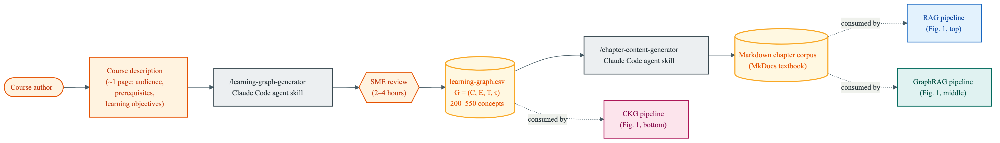
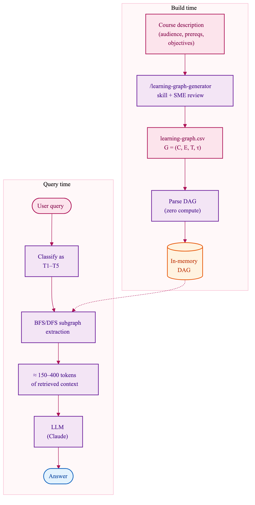
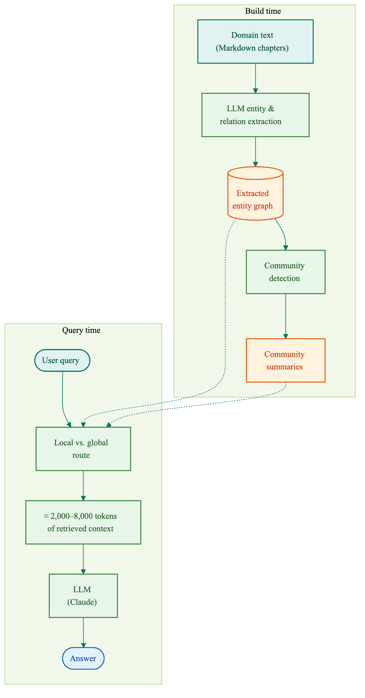
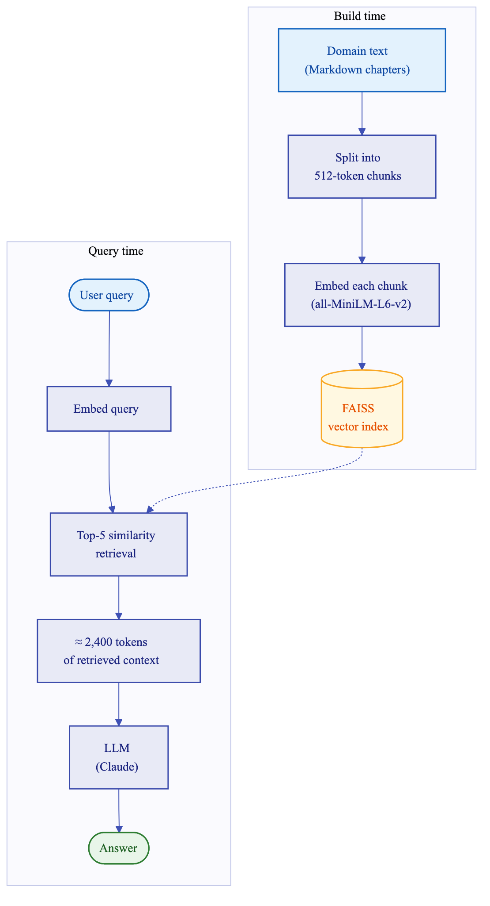

# List of MicroSims for the CKG Benchmark

Interactive diagrams and workflows that visualize the three knowledge
retrieval architectures compared in this benchmark.

-   **[Architecture Comparison](./architecture-comparison/index.md)**

    

    Interactive side-by-side diagram of all three retrieval pipelines
    (RAG, GraphRAG, CKG) in a single view. Hover any component for a
    description of its role.

-   **[Corpus Provenance](./corpus-provenance/index.md)**

    

    Upstream pipeline that produces the inputs to the three retrieval
    architectures. The learning-graph.csv seeds the textbook markdown
    corpus, which RAG and GraphRAG consume; CKG consumes the CSV
    directly.

-   **[CKG Workflow](./workflow-ckg/index.md)**

    

    Build-time and query-time pipeline for Compact Knowledge Graph
    retrieval. Parses a pre-authored DAG directly and extracts the
    relevant subgraph by BFS or DFS traversal, yielding roughly 150 to
    400 tokens of context per query.

-   **[GraphRAG Workflow](./workflow-graphrag/index.md)**

    

    Build-time and query-time pipeline for GraphRAG. Uses an LLM to
    extract an entity graph and community summaries from source text,
    then routes each query to local or global retrieval for roughly
    2,000 to 8,000 tokens of context.

-   **[RAG Workflow](./workflow-rag/index.md)**

    

    Build-time and query-time pipeline for Retrieval-Augmented
    Generation. Chunks markdown text, embeds each chunk, and retrieves
    the top-five most similar chunks per query, yielding roughly 2,400
    tokens of context.

