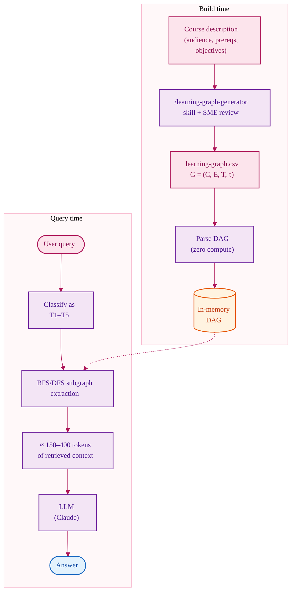

# CKG Workflow

Compact Knowledge Graph retrieval reads a pre-authored DAG directly and
extracts the subgraph relevant to each query by BFS/DFS traversal. No
embedding model, no dynamic extraction, no inference of structure from prose.

**Typical retrieved context:** ~150–400 tokens. **Build cost:** zero at inference
time — the DAG is authored once (see the Agent Skill workflow in
[Learning Graph Economics](../../paper/learning-graph-economics.md)).
**Strength:** deterministic traversal, closed vocabulary, hallucination rate
zero by construction on structural queries. **Weakness:** only works in
domains with a stable authored DAG and when queries map cleanly to traversal
operations.
