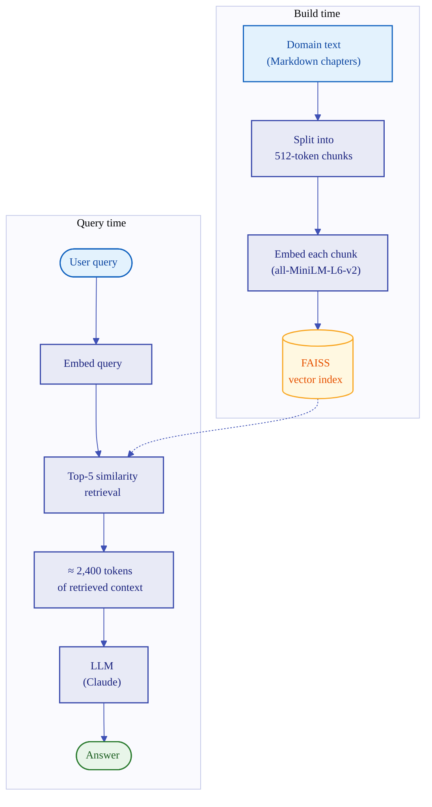

# RAG Workflow

Retrieval-Augmented Generation retrieves text chunks by vector similarity and
hands them to the LLM. Knowledge structure, if any, is inferred by the LLM from
prose.

**Typical retrieved context:** ~2,400 tokens (five 512-token chunks with
overlap). **Build cost:** embed every chunk of every document. **Strength:**
works on any unstructured corpus. **Weakness:** structural questions (paths,
prerequisites, taxonomies) require the LLM to infer structure from prose.
